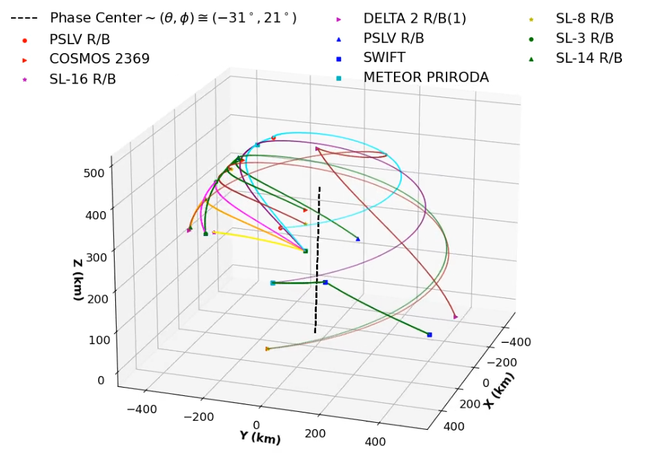

# Rad-Int-MeerkAT
Using MeerKat Radio interferometry data to analyse and understand Regions of Radio Interferance with ```daskms```

## Reproducing the Environment

To recreate the environment in which this code was run, you can use the `daskms_environment.yml` file provided in this repository. Follow the steps below:

1. Make sure you have [conda](https://docs.conda.io/projects/conda/en/latest/user-guide/install/index.html) installed on your system.

2. Clone the repository:

   ```bash
   git clone https://github.com/your-username/your-repo.git
   cd your-repo
   ```

3. Create the conda environment using the `daskms_environment.yml` file:

   ```bash
   conda env create -f daskms_environment.yml
   ```

4. Activate the environment:

   ```bash
   conda activate daskms
   ```

And you're all set!

# Sattelite Trajectory in Southern Skies (31/01/2019)
Phase center of MeerKAT pointing towards the Southern Sky with satellite trajectories tracing paths that might lead to visibility contamination from RFI. (Click on image to see different trajecotries from different satellites during the same day as the observation data.)

[](output.mp4)
(See ```Satellite_interpretation.py```)

# **Observation Summary**

This document provides an overview of the observational data collected with the **MeerKAT** telescope. Below are the key details of the observation and its metadata:
---

## **Project Information**
- **Project ID**: `20190131-0012`
- **Observer**: `Lindsay`

---

## **Observation Details**
- **Telescope Name**: MeerKAT  
- **Total Number of Antennas Used**: 50  
- **Release Date**: `5055656390 s` (from epoch)  
- **Time Range**:
  - **Start**: `5055656170 s` (from epoch)  
  - **End**: `5055656390 s` (from epoch)

---

## **Data Statistics**
- **Interval Table Shape**: `(31,875,)`  
  *(Number of intervals recorded during the observation)*  
- **Dump Rate**: `7.9966 s`  
  *(Time between data dumps)*

---


# Overview of Tables

The script utilizes the **`daskms`** package to handle Measurement Set (MS) data from radio interferometry. This package is highly efficient for working with large observational datasets.

# Data Structure Overview

The following table summarizes the shapes and dimensions of each item in the 1548939342.ms dataset file:

| **Key**                | **Shape**            | **Dim**       |
|-----------------------|----------------------|----------------|
| PROCESSOR_ID          | (31875,)             | 1              |
| STATE_ID              | (31875,)             | 1              |
| WEIGHT                | (31875, 2)           | 2               |
| ANTENNA1              | (31875,)              | 1               |
| FLAG_CATEGORY         | (31875, 1, 1024, 2)  | 4               |
| INTERVAL              | (31875,)             | 1              |
| ARRAY_ID              | (31875,)             | 1              |
| FIELD_ID              | (31875,)             | 1              |
| FEED2                 | (31875,)              | 1               |
| WEIGHT_SPECTRUM       | (31875, 1024, 2)      | 3               |
| OBSERVATION_ID        | (31875,)             | 1              |
| DATA_DESC_ID          | (31875,)             | 1              |
| UVW                   | (31875, 3)           | 2              |
| FLAG_ROW              | (31875,)             | 1              |
| EXPOSURE              | (31875,)             | 1              |
| IMAGING_WEIGHT        | (31875, 1024)        | 2              |
| DATA                  | (31875, 1024, 2)     | 3              |
| FLAG                  | (31875, 1024, 2)     | 3              |
| SIGMA                 | (31875, 2)           | 2              |
| TIME                  | (31875,)             | 1              |
| ANTENNA2              | (31875,)              | 1               |
| FEED1                 | (31875,)              | 1               |
| TIME_CENTROID         | (31875,)             | 1              |
| SCAN_NUMBER           | (31875,)             | 1              |


# Measurement Set Tables and their associative Keys

## Antenna Table
- MOUNT, TYPE, NAME, DISH\_DIAMETER, POSITION, STATION, OFFSET, FLAG\_ROW

## Feed Table
- BEAM\_ID, SPECTRAL\_WINDOW\_ID, ANTENNA\_ID, TIME, INTERVAL, POL\_RESPONSE, RECEPTOR\_ANGLE, FEED\_ID, POSITION, NUM\_RECEPTORS, POLARIZATION\_TYPE, BEAM\_OFFSET

## Field Table
- DELAY\_DIR, NUM\_POLY, SOURCE\_ID, TIME, NAME, CODE, PHASE\_DIR, REFERENCE\_DIR, FLAG\_ROW

## Observation Table
- PROJECT, SCHEDULE\_TYPE, RELEASE\_DATE, TIME\_RANGE, LOG, TELESCOPE\_NAME, SCHEDULE, OBSERVER, FLAG\_ROW

## Polarization Table
- CORR\_PRODUCT, NUM\_CORR, CORR\_TYPE, FLAG\_ROW

## Processor Table
- TYPE, MODE\_ID, TYPE\_ID, SUB\_TYPE, FLAG\_ROW

## Source Table
- SOURCE\_ID, SPECTRAL\_WINDOW\_ID, REST\_FREQUENCY, TIME, DIRECTION, INTERVAL, NAME, CALIBRATION\_GROUP, PROPER\_MOTION, NUM\_LINES, CODE

## Spectral Window Table
- FREQ\_GROUP, TOTAL\_BANDWIDTH, IF\_CONV\_CHAIN, NUM\_CHAN, NAME, NET\_SIDEBAND, FLAG\_ROW, MEAS\_FREQ\_REF, REF\_FREQUENCY, CHAN\_WIDTH, FREQ\_GROUP\_NAME, EFFECTIVE\_BW, RESOLUTION, CHAN\_FREQ

## State Table
- OBS\_MODE, REF, CAL, LOAD, SIG, SUB\_SCAN, FLAG\_ROW

## Integration with PACK.py and main.py

### Extraction Process in PACK.py
- The `PACK.py` script utilizes `daskms` to perform data extraction from dask.ms tables (declaring all variable dictionaries/tables to be used).
- **Example**:
    ```python
    import daskms

    # Example of extracting data using daskms
    ds = daskms.open("path/to/data.ms")
    visibility_data = ds["DATA"]  # Example extraction

    # Visualizing the extracted data
    plot_visibility_data(1, 2, "Antenna 1", "Antenna 2", "Short", frequency_array)
    ```
    
## Functions in PACK_func.py

### 1. `argmax_more(num, arr)`
- **Description**: Returns the index of the `num`-th maximum value in the input array.
- **Parameters**:
  - `num`: Integer indicating which maximum to return.
  - `arr`: Numpy array from which to find the maximum.
- **Returns**: Index of the `num`-th maximum value.
- **Usage**:
    ```python
    from PACK_func import argmax_more
    index = argmax_more(0, my_array)  # Getting index of 0th Longest Baseline
    ```

### 2. `argmin_more(num, arr)`
- **Description**: Returns the index of the `num`-th minimum value in the input array.
- **Parameters**:
  - `num`: Integer indicating which minimum to return.
  - `arr`: Numpy array from which to find the minimum.
- **Returns**: Index of the `num`-th minimum value.
- **Usage**:
    ```python
    from PACK_func import argmin_more
    index = argmin_more(0, my_array)  # Getting index of 0th Shortest Baseline
    ```

### 3. `plot_visibility_data(a1, a2, name1, name2, baseline_type, frequencies)`
- **Description**: Plots visibility data for a specified baseline defined by two antennas.
- **Parameters**:
  - `a1`, `a2`: Antenna identifiers.
  - `name1`, `name2`: Names of the antennas.
  - `baseline_type`: Type of baseline (e.g., "short", "long").
  - `frequencies`: Array of frequency values.
- **Returns**: None. Displays a plot.
- **Usage**:
    ```python
    from PACK_func import plot_visibility_data
    plot_visibility_data(1, 2, "Antenna 1", "Antenna 2", "Short", frequency_array)
    ```

### 4. `progressive_rfi_filter(visibility_amplitudes, frequencies, initial_kernel=29, sigma_threshold=1)`
- **Description**: Applies a progressive median filter to detect RFI (Radio Frequency Interference) in visibility data.
- **Parameters**:
  - `visibility_amplitudes`: 2D array containing visibility amplitude data.
  - `frequencies`: 1D array of frequency values.
  - `initial_kernel`: Initial kernel size for the median filter (default is 29).
  - `sigma_threshold`: Standard deviation threshold for RFI detection (default is 1).
- **Returns**: None. Displays plots of the filtering process.
- **Usage**:
    ```python
    from PACK_func import progressive_rfi_filter
    progressive_rfi_filter(visibility_data, frequency_array)
    ```

### 5. `plotting_hists(vis_clean, vis_rfi, xlims, ylims=[0,])`
- **Description**: Plots histograms for clean visibility data and RFI data.
- **Parameters**:
  - `vis_clean`: List of clean visibility data arrays.
  - `vis_rfi`: List of RFI data arrays.
  - `xlims`: Limits for the x-axis.
  - `ylims`: Limits for the y-axis (default is [0,]).
- **Returns**: None. Displays a histogram plot.
- **Usage**:
    ```python
    from PACK_func import plotting_hists
    plotting_hists(clean_data_list, rfi_data_list, x_limits, y_limits)
    ```

### Main Execution in main.py
- The `main.py` script serves as the entry point for the application, orchestrating the extraction and processing of data using functions from both `PACK.py` and `PACK_func.py`.
- **Example**:
    ```python
    from PACK import ds
    from PACK_func import progressive_rfi_filter

    # Main execution flow
    visibility_amplitudes = ds["DATA"]  # Example extraction
    progressive_rfi_filter(visibility_amplitudes, frequency_array)
    ```
This documentation provides an overview of the functions in `PACK_func.py` and their interaction with data extraction processes facilitated by `PACK.py` and `main.py`. Ensure to refer to the specific implementation details within the respective files for further insights.

